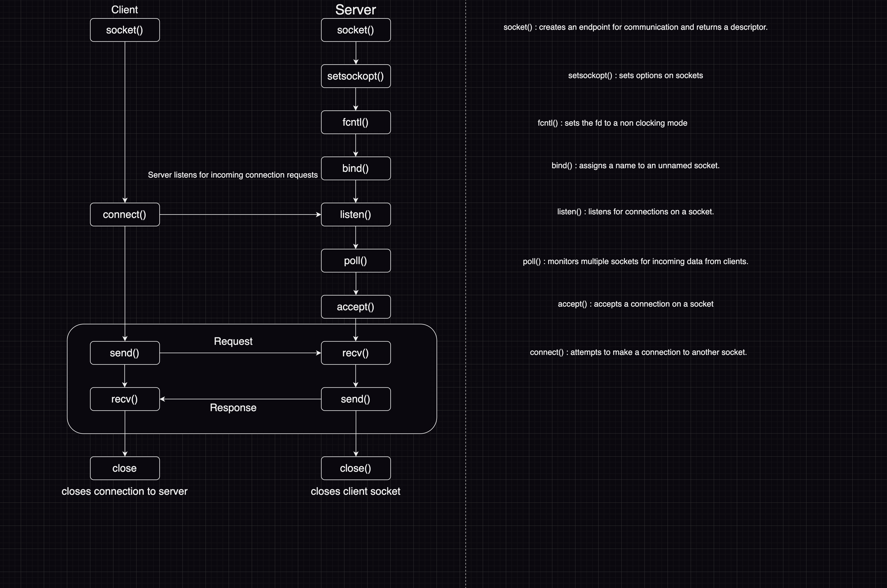

# IRC Server

### What is a Socket?
> A socket is a way to speak to other programs using standard Unix file descriptors.

### Server Structure



#### Used system calls:

<details><summary>socket()</summary>
<p>

The `socket()` function is used to create a new communication endpoint, called a socket, that can be used for network communication.

```int  socket(int domain, int type, int protocol);```

* `socket()` returns upon success a socket descriptor,  and -1  upon failure.

* `domain` Specifies the address family (protocol family) for the socket. In our case, we're gonna use **AF_INET**.

  * <span style="color: green">`AF_INET` is a constant that represents the address family (protocol family) used by the socket. It is an integer value to specify that the socket will use the IPv4 Internet protocols.</span>

* `type` Specifies the type of communication semantics that will be used on the socket. In our case we're gonna use **SOCK_STREAM**.

  * <span style="color: green">`SOCK_STREAM` is a constant that represents the type of communication semantics that will be used on the socket. It is an integer value to specify that the socket will use a reliable, sequenced, and full-duplex connection-based data transmission service.</span>

* `protocol` Specifies the specific protocol to be used with the socket. In our case we're gonna use **IPPROTO_TCP**, or 0 which which defaults to *IPPROTO_TCP*.
  * <span style="color: green">`IPPROTO_TCP` is a constant that represents the protocol number for the Transmission Control Protocol (TCP) that will be used by the socket. It is an integer value that specifies that the socket will use the TCP protocol. The **IPPROTO_TCP** constant is typically used with the AF_INET address family and the SOCK_STREAM socket type to create a TCP socket.</span>


</p>
</details>


<details><summary>setsockopt()</summary>
<p>

The `setsockopt()` function is used to set options on a socket. It allows the program to specify various socket options, such as enabling/disabling certain features or setting the value of various parameters.

```setsockopt(int socket, int level, int option_name, const void *option_value, socklen_t option_len);```

The function takes the following arguments:

* `socket`: The file descriptor of the socket on which to set the option.
  * <span style="color: green">Here we're gonna set options for the socket descriptor we got from `socket()`.</span>

* `level`: The protocol level at which the option resides. For example, SOL_SOCKET indicates that the option is at the socket API level.
  * <span style="color: green">`SOL_SOCKET` is short for "Socket Options Level - Socket". It's used to set socket options at the socket level.</span>

* `option_name`: The name of the option to set.
  * <span style="color: green">The `SO_REUSEADDR` option allows a socket to bind to a local address that is already in use by another socket. This is useful in situations where a server needs to restart or bind to the same address and port quickly after a connection is closed.</span>

* `option_value`: A pointer to the value to set for the option.

* `option_len`: The size in bytes of the option_value

</p>
</details>

<details><summary>fcntl()</summary>
<p>

The `fcntl()` provides control over descriptors.

```fcntl(int fildes, int cmd, ...)```

* `fildes`: a descriptor to be operated on by `cmd`.
  * <span style="color: green">takes our server sockfd.</span>

* `cmd`: Set descriptor status flags to `arg`(the third and last arg in our case).
  * <span style="color: green">`F_SETFL` Set descriptor status flags to `arg`.</span>

* `arg`: here we'll use the `O_NONBLOCK` flag.
  * <span style="color: green">`O_NONBLOCK`: Non-blocking I/O; if no data is available to a read/recv call, or if a write/send operation would block, the read/recv or write/send call returns -1 with the error `EAGAIN`.</span>

</p>
</details>

<details><summary>bind()</summary>
<p>

`bind()` assigns a name to an unnamed socket.  When a socket is created with `socket()` it exists in a name space (address family) but has no name
assigned.  _bind()_ requests that address be assigned to the socket.

```bind(int socket, const struct sockaddr *address, socklen_t address_len);```

* `socket`: server socketfd.

* `address`: A pointer to a `sockaddr` structure that specifies the local address to bind to the socket. The exact structure used depends on the address family of the socket.

  * We filled a sockaddr_in struct with the following:
  ```c++
  _address.sin_family = AF_INET;
  _address.sin_addr.s_addr = INADDR_ANY;
  _address.sin_port = htons(_port);
  ```
    * <span style="color: green">`address.sin_family = AF_INET` The sin_family member variable is set to the address family of the socket when the sockaddr_in structure is initialized. For IPv4 sockets, the value of sin_family should be set to AF_INET.</span>

    * <span style="color: green">`_address.sin_addr.s_addr = INADDR_ANY` When `INADDR_ANY` is used as the IP address, it tells the _bind()_ function to bind the socket to all available network interfaces on the local machine. This is useful when the exact IP address of the machine is not known or when the program needs to be able to accept connections on any available network interface.</span>

    * <span style="color: green">`_address.sin_port = htons(_port)` The sin_port member variable of the sockaddr_in structure specifies the port number of the socket address.</span>
    
[htons](https://www.tutorialspoint.com/unix_sockets/network_byte_orders.htm) resource.

[sockaddr_in](http://www.ccplusplus.com/2011/10/struct-sockaddrin.html) resource.

* `address_len`: The size of the sockaddr structure pointed to by the address argument.

</p>
</details>

<details><summary>listen()</summary>
<p>

[manual of listen](https://man7.org/linux/man-pages/man2/listen.2.html)

</p>
</details>

<details><summary>poll()</summary>
<p>

[manual of poll](https://man7.org/linux/man-pages/man2/poll.2.html)

</p>
</details>

<details><summary>accept()</summary>
<p>

[manual of accept](https://man7.org/linux/man-pages/man2/accept.2.html)

</p>
</details>

<details><summary>send()</summary>
<p>

[manual of send](https://man7.org/linux/man-pages/man2/send.2.html)

</p>
</details>

<details><summary>recv()</summary>
<p>

[manual of recv](https://man7.org/linux/man-pages/man2/recv.2.html)

</p>
</details>

#### Other Resources

[Network programming](https://beej.us/guide/bgnet/html/)

[poll() or select()](https://www.ibm.com/docs/en/i/7.4?topic=designs-using-poll-instead-select)
